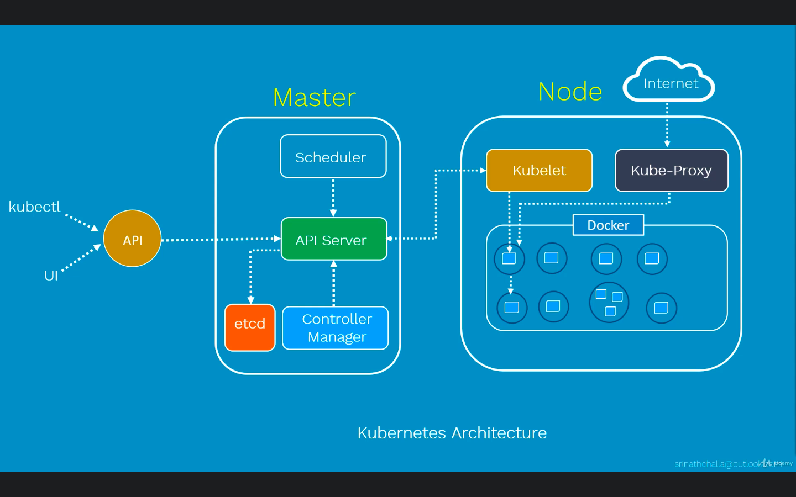

* API Server 
  * Here `API Server` is kind of a gatekeeper for the entire cluster, if you want to create, update, delete or
  even display any k8s object, it has to go through `API server`.

* Scheduler
  * it is responsible for physically scheduling pods across the nodes inside the cluster.

* Controller
  * Controller is responsible for overall health of entire cluster, it includes nodes are up and running and correct Number of nodes are running, as mentioned in the spec file.

* etcd
  * it is k8s central database to store entire k8s configuration, including objects It is creating, secrets and more. 
  * It is a key value Database. 
  * any component of  k8s can query it to understand the state of the cluster in real time. 

* Kubelet
  * It is a primary node agent that runs on each worker node inside a cluster.
  * it looks at the pod spec that was submitted to the Api Server on k8s master and ensures that the containers are described in the pod spec are running and healthy.
  * In case if Kubelet notices any failures with the pods running on this worker node, then it tries to restart the pod on same node.
  * this component that runs on all missions inside your cluster and does things like starting pods and containers.
* kube-proxy
  * it is a critical element in k8s cluster. 
  * It is responsible for maintaining the entire network configuration. 
  * It essentially maintains the distributed network across all the nodes, all the parts and across al containers. 
  * It also exposes services to the outside world on the Internet.

* pods 
  * pods basically a scheduling unit in k8s. 
  * each pod consists of one or more containers. In most cases, there would be one container. 
  * So the primary advantage of pods, we can deploy multiple dependent containers together 
  * So it acts as a wrapper around these containers.
  * pod deployment
    *
  * inter pod & intra pod communication
    * inter pod : pod networking plugin flannel (between pods)
    * intra pod : local host (within pod)
  * pod lifecycle
    * pending --> running --> succeeded
    * failed
  * pod manifest file
  *

* containers
  * It provides a run time environment for your applications, so you run containerised application processes inside these containers.

* kubeadm
  * it is responsible for bootstrapping the k8s cluster

* kubectl
  * this is the command line utility through which we can manage the cluster, such as creating, deleting, displaying and updating various k8s objects.

* 